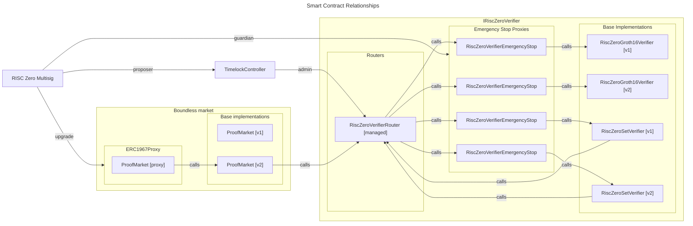

# Boundless Market Version Management

## Overview

The Boundless [ProofMarket] contract is deployed and upgraded using the **UUPS (Universal Upgradeable Proxy Standard)** proxy pattern.
This pattern allows to upgrade the contract logic while keeping all the state, providing flexibility to improve the implementation over time without service interruptions or manual migration processes.

The [RiscZeroSetVerifier] contract is deployed via a [RiscZeroVerifierEmergencyStop] contract and gated behind a [RiscZeroVerifierRouter] to allow for multiple verifier implementations to live behind a single address implementing the [IRiscZeroVerifier] interface.

### Base proof market implementations

Base proof market implementation, such as [ProofMarket], implement the order matching and fulfillment logic of the Boundless market. Each base implementation share a compatible storage layout, meaning that any change during a version upgrade can only be additive. A base implementation must be deployed with a different version and may be deployed with a different `EIP712` domain version, [assessor] image ID and URL. A [ProofMarket] implementation requires an [IRiscZeroVerifier], specifically a [RiscZeroSetVerifier] to verify the correctness of an inclusion path against a verified root. As such, each base implementation gets deployed using a [RiscZeroVerifierRouter] as the [IRiscZeroVerifier] interface, to avoid that any change to the concrete implementation of the [RiscZeroSetVerifier] (e.g., an updated imageID of the [set-builder-guest]) would warrant a change to the [ProofMarket] as well.

### ERC1967 Proxy

The [ERC1967 Proxy] enables upgradeable base proof market implementations by separating storage from logic. It uses specific storage slots to manage the implementation address, allowing updates to the contract logic without changing the contract’s state or address. This design makes it compatible with the _UUPS_ pattern for secure and flexible upgrades.

RISC Zero deploys and acts as the admin on a [ERC1967 Proxy], upgrading to a newer base proof market implementation when needed.

### Base verifier implementations

Base verifier implementations, such as [RiscZeroSetVerifier] and [RiscZeroGroth16Verifier], implement cryptographic verification of proofs. Each base implementation has an associated 4-byte selector value, derived from a hash of a label and its parameters (e.g. the imageID of the [set-builder-guest] for the [RiscZeroSetVerifier] or the Groth16 vkey, and RISC Zero [control root][term-control-root] for the [RiscZeroGroth16Verifier]).

#### RiscZeroSetVerifier

The [RiscZeroSetVerifier] requires an [IRiscZeroVerifier], specifically a [RiscZeroGroth16Verifier] to verify the correctness of a Groth16 `seal`. This requirement is fulfilled by using a [RiscZeroVerifierRouter] to avoid that any change in the concrete implementation of the [RiscZeroGroth16Verifier] (e.g., an updated Groth16 vkey or a different RISC Zero [control root][term-control-root]) would warrant a change to the [RiscZeroSetVerifier] as well.

### Emergency stop

Each base verifier can have an associated [RiscZeroVerifierEmergencyStop](./src/RiscZeroVerifierEmergencyStop.sol) contract.
This contract acts as a proxy, with the addition of an emergency stop function.
When the emergency stop is activated, this proxy will be permanently disabled, and revert on all verify calls.

There are two ways to trigger the emergency stop:

- A call from a designated "guardian" address.
- Activating the "circuit breaker" by proving the existence of a critical vulnerability in the RISC Zero proof system.

RISC Zero deploys and acts as guardian on an emergency stop contract for each of its deployed verifier contracts.

### Router

A [RiscZeroVerifierRouter] allows for multiple verifier implementations to live behind a single address implementing the [IRiscZeroVerifier] interface.
Using the verifier selector included in the seal, it will route each `verify` call to the appropriate implementation.

Implementations can be added to the router mapping by an admin of the router, who is assigned as the owner of the contract.
Implementations can also be removed by the admin, and once removed can never be replaced. I.e. each selector can have at most one implementation across time.

RISC Zero deploys and acts as the admin on a router, maintaining a recommended list of trustworthy verifiers.
Note in particular this means that RISC Zero may add new verifiers, and so a [TimelockController][TimelockController-docs] is put in place to impose a delay on all additions.

[ProofMarket]: ./src/ProofMarket.sol
[term-control-root]: https://dev.risczero.com/terminology#control-root
[TimelockController-docs]: https://docs.openzeppelin.com/contracts/5.x/api/governance#TimelockController
[IRiscZeroVerifier]: https://github.com/risc0/risc0-ethereum/blob/main/contracts/src/IRiscZeroVerifier.sol
[RiscZeroVerifierRouter]: https://github.com/risc0/risc0-ethereum/blob/main/contracts/src/RiscZeroVerifierRouter.sol
[RiscZeroVerifierEmergencyStop]: https://github.com/risc0/risc0-ethereum/blob/main/contracts/src/RiscZeroVerifierEmergencyStop.sol
[RiscZeroGroth16Verifier]: https://github.com/risc0/risc0-ethereum/blob/main/contracts/src/groth16/RiscZeroGroth16Verifier.sol
[RiscZeroSetVerifier]: ./src/RiscZeroSetVerifier.sol
[assessor]: ../crates/guest/assessor/assessor-guest/src/main.rs
[ERC1967 Proxy]: https://github.com/OpenZeppelin/openzeppelin-contracts/blob/master/contracts/proxy/ERC1967/ERC1967Proxy.sol
