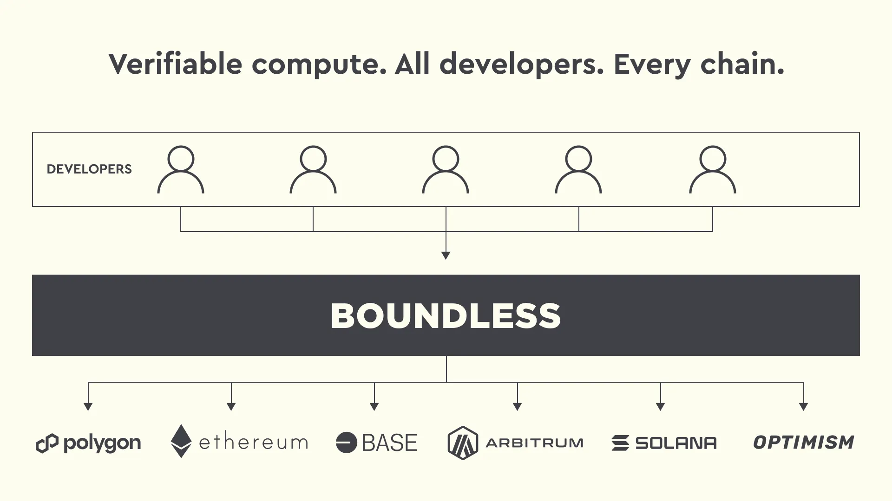

<h2> The Verifiable Compute Layer </h2>

<figure>
  
  <cap>Boundless: Verifiable Off-chain Computation on Any Chain</cap>
</figure>

This Book's goal is to:

- Enable everyone to _understand_ [Boundless][term-boundless] via the [Market Section][page-market-overview]
- Act as a User Manual for the two key _actors_ in the [Boundless Market][term-boundless-market]:
  - [Requestors][term-requestor] - using the [Requestor Manual][page-requestor-manual]
  - [Provers][term-prover] - using the [Prover Manual][page-prover-manual]

Boundless is relatively complex in it's architecture and requires idiosyncratic terms to identify what is being referenced, defined in the [glossary][page-glossary].

Helpful resources and more can be found in the [reference][page-reference].

<!-- 🔗 Reference Style -->

{{#include links.md:21:}}
